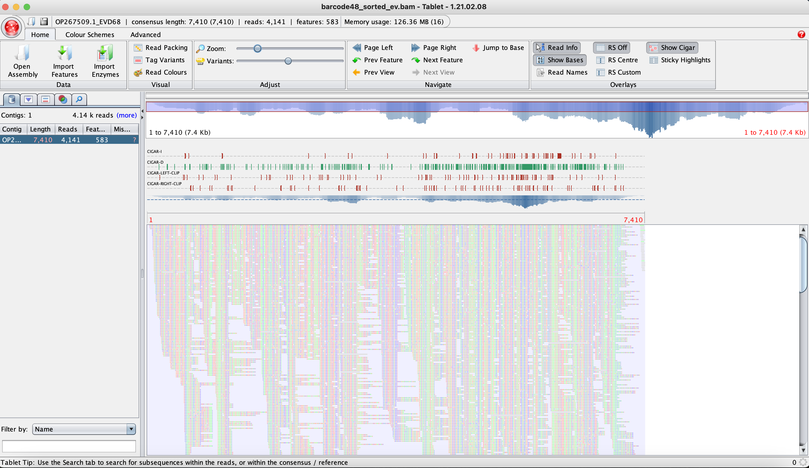
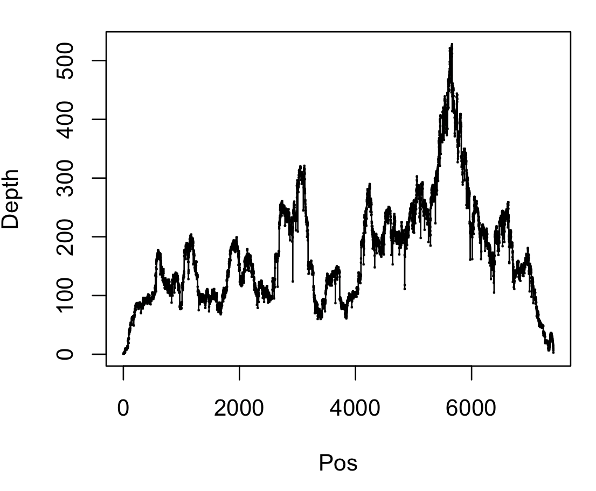
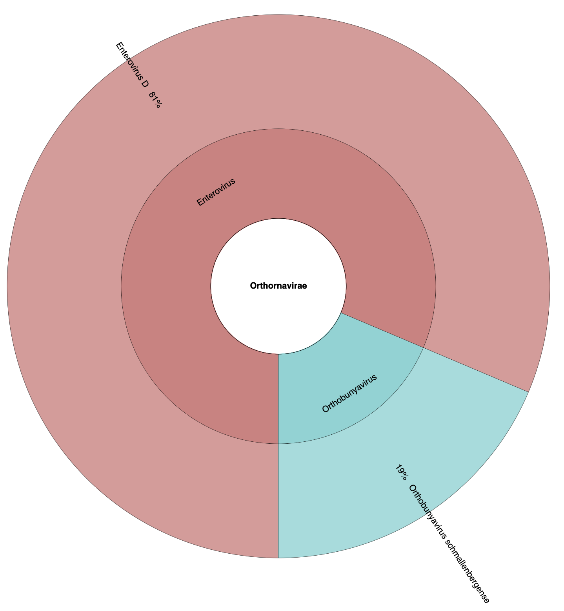

### Summrary 

[Requirements](#package-and-softwares)

[Basecalling and demultiplex](#basecalling-and-demultiplex)

[QC](#qc)

[Reference mapping](#reference-mapping)

[Coverage and consensus sequence](#coverage-and-consensus-sequence)

[Metagenomics](#metagenomics)


### Package and Softwares 

1. Linux/WSL
2. conda/bioconda 
3. dorado [github](https://github.com/nanoporetech/dorado)
4. nanoq [github](https://github.com/esteinig/nanoq)
5. minimap2*
6. samtools*
7. Tablet 
8. kraken2 [source](https://ccb.jhu.edu/software/kraken2/index.shtml) and bracken2 [source](https://ccb.jhu.edu/software/bracken/)
9. bedtools*
10. Krona*
11. bcftools* (bcftools=1.10)

*install via conda/mamba


### Files 

1. fast5_pass(.zip)
2. v3_reference.fa
3. host reference files [ensembl](https://asia.ensembl.org/Chlorocebus_sabaeus/Info/Index)
	- Human GRCh38 [cdna](https://ftp.ensembl.org/pub/release-112/fasta/homo_sapiens/)
	- African green monkey [cdna](https://ftp.ensembl.org/pub/release-112/fasta/chlorocebus_sabaeus/)
	- Aedes aegypti [cdna](https://ftp.ensemblgenomes.ebi.ac.uk/pub/metazoa/release-59/fasta/aedes_aegypti_lvpagwg/)
4. Viral database [Index zone](https://benlangmead.github.io/aws-indexes/k2)


### Note before you start

Words after the `#` (hashtag) are comments and in most case commands after the `#` won't function in the shell terminal. Therefore, you don't need to copy and paste lines after `#`s in the following sections. 


### Basecalling and demultiplex 


Specifying the direction (here: dorado-0.7.2-osx-arm64) to use the the _dorado_ you installed

```
# (with GPU) basecalling the files in fast5_all and generate calls.bam
~/Applications/dorado-0.7.2-osx-arm64/bin/dorado basecaller -v ~/Applications/dorado-0.7.2-osx-arm64/model/dna_r9.4.1_e8_hac@v3.3 fast5_all --kit-name EXP-NBD196 --barcode-both-ends > calls.bam

# (without GPU)
~/Applications/dorado-0.7.2-osx-arm64/bin/dorado basecaller -v ~/Applications/dorado-0.7.2-osx-arm64/model/dna_r9.4.1_e8_hac@v3.3 fast5_all --kit-name EXP-NBD196 --barcode-both-ends -x cpu > calls.bam


# demultiplex the calls.bam file
~/Applications/dorado-0.7.2-osx-arm64/bin/dorado demux --emit-fastq --no-classify --emit-summary --output-dir demulti calls.bam
```

### QC 

```
~/Applications/nanoq-0.10.0-x86_64-apple-darwin/nanoq -i demulti/EXP-NBD196_barcode48.fastq -s -t 5 -vvv
```

you will see:

    Nanoq Read Summary
    ====================
    
    Number of reads:      1240
    ...


### Reference mapping 


Who's in the reference file?

```
grep ">" v3_reference.fa
```

    >JN635408_MVi/NJ.USA/45.05_B3
    >KM204118.1_DV2_New_Guinea_C
    >OP267509.1_EVD68


Map the ONT sequencing result again the reference file: 


```
# index the reference
samtools faidx v3_reference.fa 

# mapping using minimap2
minimap2 -ax map-ont v3_reference.fa demulti/EXP-NBD196_barcode48.fastq > barcode48_aln.sam

# change .sam to .bam
samtools view -bS barcode48_aln.sam | samtools sort -o barcode48_sorted.bam - && samtools index barcode48_sorted.bam

# create an idxstats file
samtools idxstats barcode48_sorted.bam > barcode48_sorted_idxstats.txt
```


Which virus got most hits? (or just check `barcode48_sorted_idxstats.txt`)
```
awk '{if ($3 > max) {max=$3; ref=$1}} END {print ref}' barcode48_sorted_idxstats.txt
```

    OP267509.1_EVD68

How many mapped reads?

```
samtools view -c -F2308 barcode48_sorted.bam
```

    484


### Coverage and consensus sequence 

Parpare a reference file only containing EV

```
# get line 5-6 to anothter file called ev_ref
sed -n "5,6p" v3_reference.fa > ev_ref.fa
```

Map the new reference file go thorugh pretty much the same method as previously

```
# index the reference
samtools faidx ev_ref.fa

# mapping using minimap2
minimap2 -ax map-ont ev_ref.fa demulti/EXP-NBD196_barcode48.fastq > barcode48_ev.sam

# change .sam to .bam
samtools view -bS barcode48_ev.sam | samtools sort -o barcode48_sorted_ev.bam - && samtools index barcode48_sorted_ev.bam
```

Check the `barcode48_sorted_ev.bam` file with _Tablet_





Evaluate coverage with a table containing positions and depth of each position

```
bedtools genomecov -d -split -ibam barcode48_sorted_ev.bam > barcode48_coverage.txt
```


Visaulization the coverage (position vs depth) by any software you like (Excel, Python). 

Here's a quick example using R

```
# --- R terminal
tab = read.table("barcode48_coverage.txt")
plot(tab$V2, tab$V3, cex=0.1, pch = 22) + lines(tab$V2, tab$V3)
```




Generate a consensus sequence by piling up all the mapped reads 

```
# pile up the reads and use bcftools to call the variant 
samtools mpileup -d 100000 -uf ev_ref.fa barcode48_sorted_ev.bam | bcftools call -cv -Oz -o barcode48_pile.gz

# the variants are saved in a VCF format
tabix barcode48_pile.gz

# use the variant information to come up a new sequence by editing the reference sequence
bcftools consensus -f ev_ref.fa barcode48_pile.gz  -i '(type="snp")&((DP4[0]+DP4[1])<(DP4[2]+DP4[3]))' > barcode48_consensus.fa
```


### Metagenomics

```
# map the original .fastq data against human genome
minimap2 -ax map-ont host/Homo_sapiens.GRCh38.cdna.all.fa.gz demulti/EXP-NBD196_barcode48.fastq -o h
uman.filtered.sam

# collect unmapped reads in a new fastq
samtools fastq -n -f 4 human.filtered.sam > human.filtered.fastq
```

Download viral database [download](#files) and unzip the file 

```
# use kraken to map the .fastq to a dataset containing viral species
# k2_viral_20240605 is a folder with indexed database
kraken2-2.1.3/kraken2 -db k2_viral_20240605 --report k2.report.txt human.filtered.fastq > k2.output.log

# summarize the resulg using Bracken
Bracken-2.7/bracken -d k2_viral_20240605 -r 200 -i k2.report.txt  -l S -o bracken.tsv
```

in the summarized file `bracken.tsv` showing ~80% filtered reads from EV-D while ~20 from a cow virus.

    Enterovirus D   138951  S       345     0       345     0.81368
    Orthobunyavirus schmallenbergense       3052437 S       79      0       79      0.18632


visualize the result using Krona plot (do `updateTaxonomy.sh` if it was newly installed)

```
ktImportTaxonomy -t 5 -m 2 k2.report_bracken_species.txt
```



